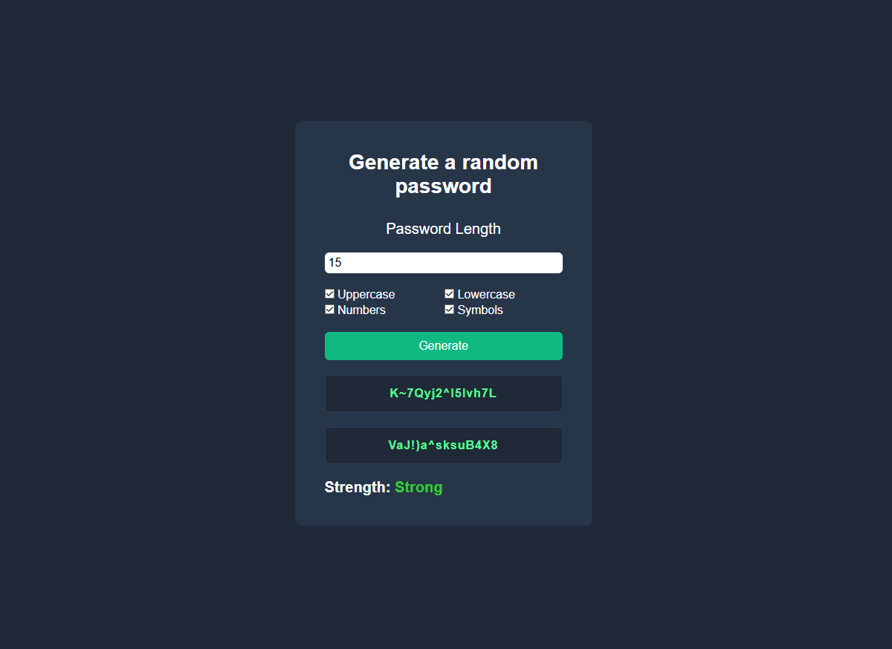

# Password Generator

A simple, interactive password generator build with **HTML, CSS and JavaScript**.

Generate **two random passwords** at once based on selected character types and see a **password strength indicator**. Click a password to copy it to your clipboard.

---

## Features
- Generate secure passwords with:
  - Uppercase letters
  - Lowercase letters
  - Numbers
  - Symbols
- Password length configurable (4 - 25 characters)
- Displays two passwords simultaneously
- Real-time **password strength indicator**: Weak, Medium, Strong
- Click-to-copy functinality

---

## How to use 
1. Open `index.html` in your browser.
2. Enter the desired password length (4-25 characters)
3. Select the character types to include:
   - Uppercase letters
   - Lowercase letters
   - Numbers
   - Symbols
4. Click **Generate**.
5. Click a password to copy it to the clipboard.
6. Check the password strength indicator for feedback.

---

## Tech Stack
- **HTML** - page structure
- **CSS** - simple styling
- **JavaScript** - DOM manipulation, password generation, validation, clipboard functionality

---

## Screenshots

